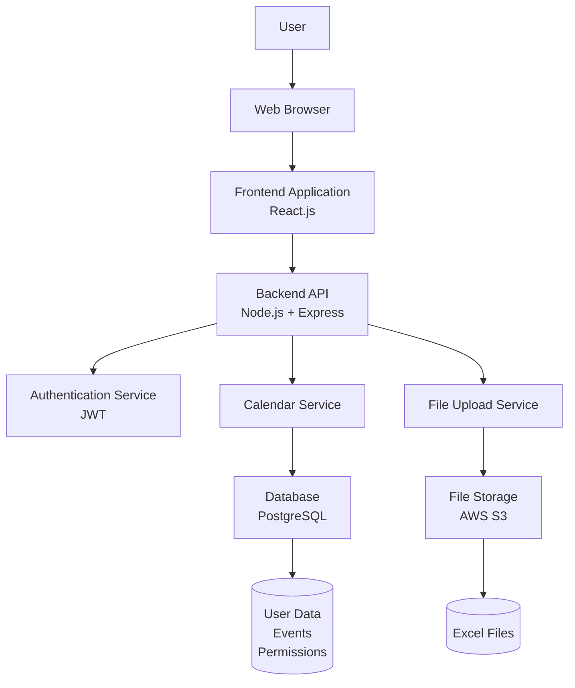

#AI-copilot-vibe-app:

#Prompt-

Application specification:
This is a *progressive web application* that allows multiple users to share their personal calendars in view-only and view-and-edit modes.
To begin with each user is presented with a blank calendar for the current and next 3 calendar years.
Users can update their calendars either by interactively adding events or by submitting an excel-sheet that has events listed for specific dates.
Each user can keep their calendar private or share it with other users. 
Each user can grant view or view-and-edit access to users they have shared their calendar with.
Every event shown on the calendar also shows which user created it. Supported event creation methods are - 
  a) manual entry via a user interface for start-date, (optional) end-date, event name and optional event details or 
  b) events entered via an excel-sheet upload with start-date, (optional) end-date, event name and optional event details.
If no end-date is provided, assume that the event is a single day event on the start-date.

Please create the below documents for this application:
1) User jouney
2) Technical stack
3) High-level system architecture

Next, create a step-wise build plan for this application, assuming development happens inside either a github codespace or a docker-container.
The build plan should be incremental, starting with a simple base functionality build following by thin slices adding new capabilities on each previous step.
The build progression should focus on getting the base functionality done for a single user first and then plugging in user identity and access management.
The base build and each incremental step should be testable - and where relevant should have a UI that the user can play around with. 

# 1. User Journey

The user journey outlines the key steps a user takes to interact with the calendar sharing application:

1. **Registration/Login**: New users create an account with email and password. Existing users log in to access their dashboard.

2. **Personal Calendar View**: After login, users are presented with their personal calendar showing the current year and the next 3 years. The calendar starts blank.

3. **Adding Events Manually**:
   - User selects a date on the calendar.
   - Enters event details: start date (pre-filled), optional end date, event name, and optional details.
   - Saves the event, which appears on the calendar with the user's name as creator.

4. **Uploading Events via Excel**:
   - User navigates to the upload section.
   - Selects and uploads an Excel file with columns for start-date, end-date (optional), event name, and details.
   - System processes the file, validates data, and adds events to the calendar.
   - Events are attributed to the uploading user.

5. **Sharing Calendar**:
   - User accesses sharing settings for their calendar.
   - Searches for other users by email or username.
   - Grants view-only or view-and-edit permissions to selected users.

6. **Viewing Shared Calendars**:
   - User sees a list of calendars shared with them.
   - Selects a shared calendar to view in read-only mode or edit mode based on permissions.
   - Events display the creator's name.

7. **Editing Shared Calendars** (if edit permission granted):
   - User can add, edit, or delete events on the shared calendar.
   - New events are attributed to the editing user.

8. **Managing Permissions**:
   - User can revoke access or change permissions for shared calendars at any time.

9. **Logout**: User logs out to secure their session.

# 2. Technical Stack

The proposed technical stack for building this calendar sharing application includes:

- **Frontend**:
  - React.js: For building the user interface, including calendar views and forms.
  - React Big Calendar or FullCalendar: For rendering interactive calendar components.
  - Axios: For making API calls to the backend.

- **Backend**:
  - Node.js with Express.js: For building RESTful APIs to handle user authentication, calendar operations, and file uploads.
  - JWT (JSON Web Tokens): For secure user authentication and session management.

- **Database**:
  - PostgreSQL: Relational database for storing user data, events, permissions, and calendar metadata.

- **File Handling**:
  - Multer: Middleware for handling file uploads (Excel files).
  - xlsx or exceljs: Libraries for parsing Excel files to extract event data.

- **Authentication & Security**:
  - bcrypt: For hashing passwords.
  - Helmet: For securing Express apps with various HTTP headers.

- **Deployment & Hosting**:
  - AWS (Amazon Web Services): EC2 for server hosting, S3 for file storage, RDS for database.
  - Docker: For containerizing the application for easy deployment.

- **Other Tools**:
  - Git: Version control.
  - ESLint and Prettier: Code quality and formatting.
  - Jest: For unit testing.

# 3. High Level System Architecture Diagram

# 4. Step-Wise Build Plan

This build plan outlines an incremental development approach for the calendar sharing application. Development assumes use of a GitHub Codespace or Docker container for a consistent environment. Each step builds on the previous one, starting with core single-user functionality before adding multi-user features. Steps include setup, implementation, testing, and UI validation where applicable.

## Prerequisites
- Set up a GitHub Codespace or Docker container with Node.js, npm, and PostgreSQL installed.
- Initialize a Git repository for version control.
- Use ESLint and Prettier for code quality.

## Step 1: Project Setup and Basic Frontend Calendar View
- **Objective**: Create a basic React app with a static calendar view for a single user.
- **Implementation**:
  - Set up a new React project using Create React App.
  - Install React Big Calendar or FullCalendar.
  - Create a calendar component displaying the current year and next 3 years (blank).
  - Add basic styling for a clean UI.
- **Testing**: Verify the calendar renders correctly in the browser. Manually check navigation between months/years.
- **UI**: Basic calendar grid with month/year headers; no interactivity yet.

## Step 2: Manual Event Addition (Single User)
- **Objective**: Allow manual addition of events to the calendar.
- **Implementation**:
  - Add a form/modal for event details: start date (pre-filled), optional end date, name, optional details.
  - Integrate with calendar to display events on selected dates.
  - Store events in local state (no backend yet).
  - Show creator name (hardcoded as "User" for now).
- **Testing**: Add events via form, confirm they appear on calendar. Test single-day vs. multi-day events.
- **UI**: Clickable dates to open event form; events displayed as colored blocks on calendar.

## Step 3: Backend Setup and API for Events
- **Objective**: Set up Express backend with PostgreSQL and basic CRUD for events.
- **Implementation**:
  - Create Node.js/Express server.
  - Set up PostgreSQL database with events table (id, start_date, end_date, name, details, creator).
  - Implement REST APIs: GET /events, POST /events, PUT /events/:id, DELETE /events/:id.
  - Connect frontend to backend using Axios.
  - Migrate events from local state to API calls.
- **Testing**: Use Postman or curl to test APIs. Verify events persist in database and load in UI.
- **UI**: Same as Step 2, but events now persist across page reloads.

## Step 4: Excel Upload for Events
- **Objective**: Enable uploading Excel files to add multiple events.
- **Implementation**:
  - Install Multer and xlsx/exceljs on backend.
  - Add file upload endpoint: POST /upload.
  - Parse Excel (columns: start_date, end_date, name, details) and insert into database.
  - Add upload UI in frontend (file input, progress indicator).
  - Validate data (e.g., date formats).
- **Testing**: Upload sample Excel file, check events added to calendar. Test error handling for invalid files.
- **UI**: Upload button/section; success/error messages after upload.

## Step 5: User Authentication
- **Objective**: Add user registration and login.
- **Implementation**:
  - Add user table in database (id, email, password_hash).
  - Implement registration/login APIs with JWT.
  - Install bcrypt for password hashing.
  - Add auth middleware to protect event APIs.
  - Update frontend with login/register forms and token storage.
  - Associate events with authenticated user.
- **Testing**: Register user, login, add events (only own events visible). Test invalid credentials.
- **UI**: Login/register pages; redirect to calendar after auth.

## Step 6: Calendar Sharing and Permissions
- **Objective**: Enable sharing calendars with view-only or view-and-edit permissions.
- **Implementation**:
  - Add permissions table (user_id, shared_with_user_id, calendar_id, permission_level).
  - APIs for sharing: POST /share, GET /shared-calendars.
  - Modify event APIs to check permissions (view vs. edit).
  - Add sharing UI: search users by email, set permissions.
  - Display shared calendars in a list/sidebar.
- **Testing**: Share calendar with another user (simulate via API), verify access levels. Test permission changes.
- **UI**: Sharing modal; list of shared calendars with view/edit buttons.

## Step 7: Multi-User Calendar Viewing and Editing
- **Objective**: Allow viewing and editing shared calendars.
- **Implementation**:
  - Update calendar view to load shared calendars.
  - Enforce permissions: read-only for view, editable for edit.
  - Show creator name on all events.
  - Handle conflicts (e.g., prevent editing if no permission).
- **Testing**: Switch between personal and shared calendars. Add/edit events on shared calendars based on permissions.
- **UI**: Dropdown or tabs for personal vs. shared calendars; events show creator labels.

## Step 8: Permissions Management and Final Polish
- **Objective**: Add UI for managing permissions and refine the app.
- **Implementation**:
  - UI for revoking/changing permissions.
  - Add Helmet for security headers.
  - Implement logout and session management.
  - Progressive Web App features (e.g., service worker for offline).
- **Testing**: Full user journey: register, add events, share, view/edit shared, manage permissions. Test on mobile/desktop.
- **UI**: Settings page for permissions; PWA install prompt.

Each step should be committed to Git with descriptive messages. Run Jest tests for backend logic and manual UI testing in the browser. Deploy incrementally to a staging environment for broader testing. 

